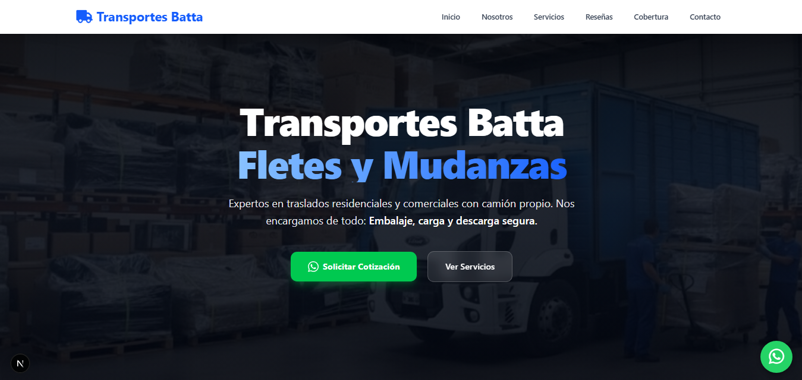

# Transportes Batta  🚚


> Plataforma web oficial para Transportes Batta. Diseñada para ofrecer una experiencia de usuario fluida, rápida y optimizada para conversiones (cotizaciones y contacto).

---



## 🎯 Proyecto

Este proyecto es una **Landing Page de alto rendimiento** (Single Page Application adaptada) construida con las últimas tecnologías del ecosistema frontend. Está orientada a la conversión de clientes de servicios de fletes y mudanzas.

**Aspectos destacados:**
- **Performance & SEO:** Utiliza Next.js en su modo de exportación estática (`output: 'export'`), garantizando tiempos de carga ultrarrápidos (TTFB mínimo) y seguridad absoluta al no depender de un servidor Node.js en tiempo de ejecución.
- **UI/UX Moderna:** Diseño 100% responsivo "Mobile-First" construido con Tailwind CSS v4. Incluye micro-interacciones suaves utilizando `animate.css`.
- **Accesibilidad y UX:** Manejo avanzado de modales a través de Context API, previniendo el "layout shift" y controlando el scroll del body dinámicamente cuando los usuarios interactúan.
- **Redirecciones y Seguridad:** Archivo `_redirects` y `robots.txt` configurados para prevenir el escaneo malicioso de bots (ej. wp-admin) y mantener el "link juice" en rutas antiguas.

---

## 💻 Arquitectura y Decisiones Técnicas

El proyecto utiliza **Next.js App Router** (`src/app`). Aunque es un sitio estático, se ha estructurado de forma modular para escalar fácilmente:

- **State Management:** En lugar de librerías externas pesadas, se utiliza React Context (`src/context/ModalContext.tsx`) para estados globales simples (como el control de modales flotantes).
- **Componentización:** La UI está fuertemente dividida en `layouts` (como el Navigator) y `sections` (Hero, Nosotros, Servicios, etc.) dentro de `src/app/landing`.
- **Rutas y SPA Fallback:** Al ser un Static Site, el ruteo hacia la landing se inyecta en la raíz (`page.tsx`), mientras que rutas inexistentes son capturadas mediante SPA rewrites configurados para el hosting.

### Estructura de Carpetas Principal

```text
src/
├── app/                  # App Router de Next.js
│   ├── landing/          # Módulo principal de la landing page
│   │   └── sections/     # Componentes de sección (Hero, Contacto, etc.)
│   ├── layouts/          # Componentes de Layout globales (Navigator)
│   ├── globals.css       # Estilos globales y utilidades Tailwind
│   └── page.tsx          # Entry point principal
├── context/              # Context Providers (ModalContext)
├── assets/               # Imágenes estáticas y recursos SVG
└── utils/                # Utilidades y helpers TypeScript
public/
├── _redirects            # Reglas de enrutamiento estático (Netlify/Cloudflare)
└── robots.txt            # Reglas de indexación y bloqueo de bots
```

---

## 🚀 Guía de Inicio Rápido

Sigue estos pasos para correr el proyecto en tu entorno local.

### 1. Clonar e Instalar
Asegúrate de tener **Node.js 20+** instalado.

```bash
# Clonar el repositorio
git clone <url-del-repo>

# Entrar al directorio
cd website-dibat

# Instalar dependencias
npm install
```

### 2. Entorno de Desarrollo
Para levantar el servidor de desarrollo con Hot-Module Replacement (HMR):

```bash
npm run dev
```
La aplicación estará disponible en [http://localhost:3000](http://localhost:3000).

### 3. Build para Producción
Este proyecto está configurado para exportación estática (`output: 'export'` en `next.config.ts`).

```bash
npm run build
```
Esto generará una carpeta `out/` con todos los archivos HTML, CSS y JS compilados y minificados, listos para subirse a cualquier CDN o hosting estático.

---

## ☁️ Despliegue (Deployment)

El proyecto está diseñado para ser alojado en plataformas modernas de tipología Serverless/Edge (como **Netlify**, **Vercel** o **Cloudflare Pages**).

- La configuración de enrutamiento estático y fallbacks de Single Page Application se encuentra automatizada en el archivo `public/_redirects`.
- Esto asegura que cualquier sub-ruta retorne un código `200` apuntando a `index.html` para que Next.js asuma el control del cliente y decida si renderizar o mostrar la página de error `404`.

---

## 🛠️ Buenas Prácticas Aplicadas

1. **Strict TypeScript:** Todo el código base usa TS estricto, reduciendo errores en tiempo de ejecución.
2. **Next/Link:** Uso de `<Link>` para una navegación interna pre-cargada y eficiente.
3. **Imágenes Optimizadas:** Uso extendido de formato `.webp`.
4. **Semántica HTML5:** Uso correcto de etiquetas `<section>`, `<nav>`, `<main>`, `<footer>` y atributos `aria-label` para accesibilidad.
